# D.1 Diagrama de Clases Completo

> **Versión ASCII (texto plano)** para copiar en draw.io / Lucidchart  
> **Versión PlantUML** al final para renderizar en [PlantText](https://www.planttext.com), VS Code, IntelliJ o [PlantUML Online Server](http://www.plantuml.com/plantuml/)

---

## D.1.1 Convenciones del diagrama

| Símbolo | Significado |
|---------|-------------|
| `+` | Atributo o método público |
| `-` | Atributo o método privado |
| `→` | Asociación (usa/referencia) |
| `◆─` | Composición (el componente no existe sin el contenedor) |
| `◇─` | Agregación (el componente puede existir independientemente) |
| `▷─` | Herencia/Extensión |

---

## D.1.2 Modelos de Datos (Capa de Dominio)

```
┌─────────────────────────────┐
│      <<model>>              │
│   PictogramaPersonalizado   │
├─────────────────────────────┤
│ + id: String                │
│ + imageUrl: String          │
│ + etiqueta: String          │
│ + textoTts: String          │
│ + categoria: String         │
│ + createdAt: DateTime       │
├─────────────────────────────┤
│ + fromFirestore(doc):       │
│   PictogramaPersonalizado   │
│ + toMap(): Map<String,dyn>  │
└─────────────────────────────┘

┌─────────────────────────────┐
│      <<model>>              │
│       Pictograma            │
├─────────────────────────────┤
│ + id: String                │
│ + rutaSvg: String           │
│ + etiqueta: String          │
│ + textoTts: String          │
│ + categoria: String         │
└─────────────────────────────┘

┌─────────────────────────────┐
│      <<model>>              │
│    PictogramaDisplay        │
├─────────────────────────────┤
│ + id: String                │
│ + rutaSvg: String?          │
│ + imageUrl: String?         │
│ + etiqueta: String          │
│ + textoTts: String          │
│ + categoria: String         │
│ + esPersonalizado: bool     │
├─────────────────────────────┤
│ + fromLocal(p): Display     │
│ + fromCustom(p): Display    │
└─────────────────────────────┘

┌─────────────────────────────┐
│      <<model>>              │
│       PictoEntry            │
├─────────────────────────────┤
│ + id: String                │
│ + svgPath: String?          │
│ + imageUrl: String?         │
│ + etiqueta: String          │
│ + defaultCategoria: String  │
│ + esPersonalizado: bool     │
└─────────────────────────────┘

┌─────────────────────────────┐
│      <<model>>              │
│      AvatarOption           │
├─────────────────────────────┤
│ + name: String              │
│ + imagePath: String         │
│ + color: Color              │
└─────────────────────────────┘

┌─────────────────────────────┐
│      <<enum>>               │
│        UserRole             │
├─────────────────────────────┤
│ tutor                       │
│ usuario                     │
└─────────────────────────────┘

┌─────────────────────────────┐
│      <<enum>>               │
│     PomodoroStatus          │
├─────────────────────────────┤
│ idle                        │
│ running                     │
│ paused                      │
│ finished                    │
└─────────────────────────────┘

┌─────────────────────────────┐
│      <<enum>>               │
│       NavScreen             │
├─────────────────────────────┤
│ inicio                      │
│ tareas                      │
│ pictogramas                 │
│ foco                        │
│ perfil                      │
└─────────────────────────────┘

┌─────────────────────────────┐
│    <<constants>>            │
│      ActivityType           │
├─────────────────────────────┤
│ + taskCompleted: String     │
│ + taskCreated: String       │
│ + taskDeleted: String       │
│ + pictogramCreated: String  │
│ + pictogramDeleted: String  │
│ + pictogramUsed: String     │
│ + pomodoroCompleted: String │
└─────────────────────────────┘

┌─────────────────────────────┐
│      <<DTO>>                │
│   NotificationTestResult    │
├─────────────────────────────┤
│ + notificationSent: bool    │
│ + previewSoundPlayed: bool  │
│ + failure: Failure?         │
│ + errorDescription: String? │
│ + usedFallbackSound: bool   │
└─────────────────────────────┘

┌─────────────────────────────┐
│      <<DTO>>                │
│     DriveBackupStatus       │
├─────────────────────────────┤
│ + success: bool             │
│ + message: String           │
│ + timestamp: DateTime?      │
│ + filesUploaded: int?       │
└─────────────────────────────┘

┌─────────────────────────────┐
│      <<DTO>>                │
│    DriveRestoreResult       │
├─────────────────────────────┤
│ + success: bool             │
│ + message: String           │
│ + cloudIsNewer: bool        │
│ + restoredFiles: List<String│
└─────────────────────────────┘
```

---

## D.1.3 Servicios de Aplicación (Capa de Negocio)

```
┌─────────────────────────────┐
│   <<service>>               │
│      AuthService            │
├─────────────────────────────┤
│ - _auth: FirebaseAuth       │
│ - _firestore: Firestore     │
│ - _googleSignIn: GoogleSignIn│
├─────────────────────────────┤
│ + authStateChanges: Stream  │
│ + currentUser: User?        │
│ + registerWithEmail(...)    │
│ + loginWithEmail(...)       │
│ + loginWithGoogle(): Future │
│ + getUserRole(): Future     │
│ + getUserRoleStream(): Strm │
│ + setRole(role): Future     │
│ + generateInvitationCode()  │
│ + validateInvitationCode()  │
│ + acceptInvitationCode()    │
│ + removePatientLink()       │
│ + getLinkedPatientsStream() │
│ + getLinkedTutorStream()    │
│ + logout(): Future          │
└─────────────────────────────┘

┌─────────────────────────────┐
│   <<service>>               │
│   ActivityLogService        │
├─────────────────────────────┤
│ - _firestore: Firestore     │
│ - _auth: FirebaseAuth       │
├─────────────────────────────┤
│ + log({userId,type,desc,   │
│   metadata}): Future        │
│ + getStream(userId): Stream │
│   <List<Map>>               │
└─────────────────────────────┘

┌─────────────────────────────┐
│   <<service>>               │
│     AudioService            │
│    (Singleton)              │
├─────────────────────────────┤
│ - _player: AudioPlayer      │
│ - _cache: Map<String,String>│
│ - _isPlaying: bool          │
│ - _onPlayingChanged: Func?  │
├─────────────────────────────┤
│ + instance: AudioService    │
│ + isPlaying: bool           │
│ + setOnPlayingChanged(fn)   │
│ + playText(text,vozId): Fut │
│ + stop(): Future            │
│ + clearCache(): Future      │
│ + getCacheSize(): Future<int│
│ + dispose()                 │
│ - _hashText(text): String   │
│ - _fetchFromCloud(text): Fut│
│ - _playFile(path): Future   │
└─────────────────────────────┘

┌─────────────────────────────┐
│   <<service>>               │
│  NotificationService        │
├─────────────────────────────┤
│ - _plugin: FlutterLocal...  │
│ - _initialized: bool        │
│ - _tzInitialized: bool      │
│ - _pomodoroNotificationId   │
│ - _channel: AndroidNotif... │
├─────────────────────────────┤
│ + init(): Future            │
│ + ensureDeviceCanDeliver()  │
│ + requestPermissions(): Fut │
│ + showInstantNotification() │
│ + showTestNotification():   │
│   NotificationTestResult    │
│ + showPomodoroFinished()    │
│ + schedulePomodoroNotif(dt) │
│ + cancelPomodoroNotif()     │
│ + scheduleReminderIfNeeded()│
│ + cancelTaskNotification()  │
│ - _defaultDetails(): Notif..│
│ - _configureLocalTimezone() │
│ - _arePermissionsGranted()  │
│ - _hasExactAlarmPermission()│
└─────────────────────────────┘

┌─────────────────────────────┐
│   <<service>>               │
│    PictogramService         │
├─────────────────────────────┤
│ - _storage: FirebaseStorage │
│ - _firestore: Firestore     │
│ - _auth: FirebaseAuth       │
│ - _picker: ImagePicker      │
├─────────────────────────────┤
│ + getCustomPictogramsStream()│
│ + getCustomPictogramsStreamFor()│
│ + getPictogramSettingsStrm()│
│ + updatePictogramSettingFor()│
│ + createPictogramFor(...)   │
│ + createPictogram(...)      │
│ + deletePictogramFor(...)   │
│ + deletePictogram(...)      │
│ + pickImageFromCamera()     │
│ + pickImageFromGallery()    │
│ + cropImage(...): Cropped?  │
│ + uploadImage(...): String  │
│ + uploadImageFor(...): Str  │
│ + captureAndCreate(): Picto?│
└─────────────────────────────┘

┌─────────────────────────────┐
│   <<service>>               │
│   ReminderDispatcher        │
├─────────────────────────────┤
├─────────────────────────────┤
│ + scheduleTaskReminder(...) │
│ + cancelTaskReminder(...)   │
│ + normalizeReminderMinutes()│
└─────────────────────────────┘
            ◇
            │ (usa)
    ┌───────┴───────┐
    │               │
┌───┴───┐      ┌────┴────────┐
│Notif. │      │PushNotif.   │
│Service│      │Service      │
└───────┘      └─────────────┘

┌─────────────────────────────┐
│   <<service>>               │
│ PushNotificationService     │
├─────────────────────────────┤
│ + queueRemoteReminder(...)  │
│ + cancelRemoteReminder(...) │
└─────────────────────────────┘

┌─────────────────────────────┐
│   <<service>>               │
│      UserPrefs              │
├─────────────────────────────┤
│ - _kName: String            │
├─────────────────────────────┤
│ + setName(name): Future     │
│ + getName(): Future<String?>│
│ + clearName(): Future       │
└─────────────────────────────┘

┌─────────────────────────────┐
│   <<service>>               │
│   GoogleDriveService        │
│    (Singleton)              │
├─────────────────────────────┤
│ - _cachedAccount: GoogleAcct│
│ - _driveApi: DriveApi?      │
│ - _backupFolderName: String │
│ - _settingsFileName: String │
│ - _pictogramsSubfolder: Str │
│ - _lastSyncKey: String      │
├─────────────────────────────┤
│ + instance: GoogleDriveSvc  │
│ + backupToDrive():          │
│   DriveBackupStatus         │
│ + restoreFromDrive():       │
│   DriveRestoreResult        │
│ + getLastSyncTime(): Future │
│ + isCloudNewerThanLocal()   │
│ + signOut()                 │
│ - _ensureSignedIn(): Future │
│ - _getOrCreateBackupFolder()│
│ - _collectSettings(): Map   │
│ - _applySettings(map): Fut  │
│ - _getLocalPictogramFiles() │
│ - _getLocalPictogramsDir()  │
│ - _collectBytes(stream): Fut│
└─────────────────────────────┘
            ◇
            │ (usa)
    ┌───────┴───────┐
    │               │
┌───┴───┐      ┌────┴────────┐
│Google │      │GoogleAuth   │
│SignIn │      │HttpClient   │
└───────┘      └─────────────┘

┌─────────────────────────────┐
│   <<service>>               │
│       IAService             │
├─────────────────────────────┤
│ - _functions: FirebaseFunc  │
├─────────────────────────────┤
│ + desglosarEnPasos({        │
│   tarea,tiempoDisponible}): │
│   Future<List<Map>>         │
│ - _mapFirebaseError(e): Str │
│ - _mapGenericError(e): Str  │
└─────────────────────────────┘

┌─────────────────────────────┐
│   <<service>>               │
│     StreakService           │
├─────────────────────────────┤
├─────────────────────────────┤
│ + updateStreakOnTaskComp()  │
│ - _computeNewStreak(...):int│
│ - _stripTime(date): DateTime│
└─────────────────────────────┘

┌─────────────────────────────┐
│   <<service>>               │
│    PomodoroService          │
│   (ChangeNotifier)          │
├─────────────────────────────┤
│ + totalDuration: Duration   │
│ + remaining: Duration       │
│ + status: PomodoroStatus    │
│ - _ticker: Timer?           │
│ - _endTime: DateTime?       │
├─────────────────────────────┤
│ + start(duration): Future   │
│ + pause(): Future           │
│ + resume(): Future          │
│ + cancel(): Future          │
│ - _tick(): Future           │
│ - _persistState(): Future   │
│ - _restoreState(): Future   │
│ - _scheduleSystemNotif()    │
│ - _cancelNotificationSafely()│
└─────────────────────────────┘
```

---

## D.1.4 Pantallas y Widgets (Capa de Presentación)

```
<<screen>> AuthGate (StatelessWidget)
  → StreamBuilder<User?> (authStateChanges)
    → StreamBuilder<UserRole?> (getUserRoleStream)
      → RoleDispatcher
        → PantallaUsuarioTEA | HomeScreen | RoleSelectionScreen

<<screen>> LoginScreen (StatefulWidget)
  - _formKey: GlobalKey<FormState>
  - _emailController: TextEditingController
  - _passwordController: TextEditingController
  - _nameController: TextEditingController
  - _isLogin, _isLoading, _isGoogleLoading, _obscurePassword: bool
  + _handleLogin(): Future
  + _handleGoogleLogin(): Future
  + _handleForgotPassword(): Future
  + _buildInput(...): Widget
  + _mapAuthError(code): String

<<screen>> RoleSelectionScreen (StatefulWidget)
  - _loadingRole: String?
  + _selectRole(role): Future
  → _RoleCard (private widget)

<<screen>> ProfileSetupScreen (StatefulWidget)
  - _avatars: List<String>
  - _nameCtrl: TextEditingController
  - _selectedAvatar: String?
  - _saving: bool
  + _save(): Future

<<screen>> HomeScreen (StatefulWidget)
  - _motivationalPhrases: List<String>
  - _dateTimeFormatter: DateFormat
  + _buildAppBar(): AppBar
  + _buildBody(): Widget
  + _buildGreeting(name): Widget
  + _buildPriorityTaskCard(): Widget
  + _buildEmptyPriorityCard(): Widget
  + _buildTaskCard(...): Widget
  + _buildQuickAccess(): Widget
  + _toggleTaskCompletion(...): Future
  + _showTaskOptionsDialog(...): void
  + _showEditTaskDialog(...): void

<<screen>> PantallaUsuarioTEA (StatefulWidget)
  - _tts: FlutterTts
  - _localOverrides: Map<String,String>
  - _pictoSettings: Map<String,Map>
  - _settingsSub: StreamSubscription?
  - _userSub: StreamSubscription?
  - _emergencyName, _emergencyPhone: String?
  - _transicionNotificada: bool
  - _pictogramasStream: Stream?
  + _initTts(): Future
  + _buildPictogramasStream(): Stream
  + _crearPictograma(): Future
  + _abrirManager(): void
  + _hablar(texto): Future
  + _hablarPictograma(picto): void
  + _editarTexto(picto): Future
  + _showSosDialog(): Future
  + _catHoraria: String
  + _nombreRutina: String
  + _iconoRutina: IconData
  + _siguienteActividad: String
  + _filtrarPorCategoria(todos,cat): List
  + _onTransicionCercana(): void
  + _resetTransicionFlag(): void
  + _buildAyudaRow(colors): Widget
  → ContadorTransicion (StatefulWidget)
  → _GridCategoriaDisplay (StatefulWidget)
  → _TarjetaPictogramaDisplay (StatefulWidget)

<<screen>> TareasScreen (StatefulWidget)
  → StreamBuilder<QuerySnapshot>
    → Lista de tareas con categorías, fechas, checkboxes
    → FAB para agregar tarea

<<screen>> FocoScreen (StatefulWidget)
  → Provider<PomodoroService>
    → Timer visual circular
    → Botones Start/Pause/Resume/Cancel
    → Configuración de sonido/vibración

<<screen>> SettingsScreen (StatefulWidget)
  - _userDoc: DocumentReference
  - _emergencyNameController: TextEditingController
  - _emergencyPhoneController: TextEditingController
  - _isEmergencyDirty: bool
  - _isSavingEmergency: bool
  - _isUploadingPhoto: bool
  - _isBackingUp: bool
  - _backupProgress: double?
  - _lastSync: DateTime?
  + _handleLogout(): Future
  + _saveEmergencyContact(): Future
  + _uploadProfilePhoto(): Future
  + _showPhotoOptions(current): Future
  + _showAvatarPicker(current): Future
  + _resolveAvatar(photoUrl,avatar): ImageProvider?
  + _editDisplayName(current): Future
  + _showRoleChangeConfirmation(): Future
  + _buildProfileRoleCard(...): Widget
  + _buildVinculacionCard(): Widget
  + _buildVinculacionUsuarioCard(): Widget
  + _buildPantallasNavTile(): Widget
  + _buildEmergencyCard(): Widget
  + _buildNotificacionesCard(...): Widget
  + _buildFocoCard(...): Widget
  + _buildBackupCard(): Widget
  + _buildLogoutCard(): Widget
  + _handleBackup(): Future
  + _handleRestore(): Future
  + _formatSyncDate(date): String

<<screen>> TutorSupervisarScreen (StatefulWidget)
  - _currentIndex: int
  - _patients: List<Map>
  - _selectedPatient: Map?
  - _loading: bool
  - _patientsSub: StreamSubscription
  + _patientId: String
  + _patientName: String
  + _patientAvatar: String?
  + _switchPatient(patient): void
  + _showPatientPicker(): void
  + _buildAppBar(): AppBar
  + _buildNoPatients(): Widget
  → _TutorTasksTab (StatefulWidget)
  → _TutorPictogramsTab (StatelessWidget)
  → ProgresoScreen (StatefulWidget)
  → _TutorHistorialTab (StatelessWidget)
  → _TutorConfigTab (StatefulWidget)

<<screen>> TutorVinculacionScreen (StatefulWidget)
  - _isGenerating: bool
  - _currentCode: String?
  + _generateCode(): Future
  + _copyCode(code): void
  + _removePatient(patientId,name): Future
  + _buildGenerateCodeCard(): Widget
  + _buildCodeDisplayCard(code): Widget
  + _buildLinkedPatientsList(): Widget
  + _buildPatientTile(...): Widget
  + _formatDate(date): String

<<screen>> VinculacionTutorScreen (StatefulWidget)
  - _codeController: TextEditingController
  - _isValidating: bool
  - _isAccepting: bool
  - _validationResult: Map?
  - _isLinked: bool
  + _checkIfAlreadyLinked(): Future
  + _validateCode(): Future
  + _acceptCode(): Future
  + _buildAlreadyLinkedView(): Widget
  + _buildInfoCard(): Widget
  + _buildCodeInputCard(): Widget
  + _buildValidationSuccessCard(): Widget
  + _buildHowItWorksCard(): Widget
  + _buildStep(...): Widget

<<screen>> PictogramManagerScreen (StatefulWidget)
  - _settings: Map<String,Map>
  - _loadingSettings: bool
  - _customs: List<PictogramaPersonalizado>
  - _loadingCustoms: bool
  - _filterCat: String?
  + _efectiva(id,defaultCat): String
  + _visible(id): bool
  + _setCategoria(id,newCat): Future
  + _toggleVisible(id): Future
  + _allEntries: List<PictoEntry>
  + _filtered: List<PictoEntry>
  + _buildFilterBar(): Widget
  + _buildLegend(): Widget
  + _buildGrid(): Widget
  + _showCategoryPicker(entry): void
  + _resetAll(): Future
  → _PictoManagerCard (StatelessWidget)

<<screen>> SuperExpertoSheet (StatefulWidget)
  - _tareaId: String?
  - _tareaTexto: String?
  - _tiempo: String
  - _cargando: bool
  - _error: String?
  - _pasos: List<Map<String,String>>?
  - _guardando: bool
  - _guardadoExito: bool
  + _generarPlan(): Future
  + _guardarSubtareas(): Future
  + _buildHeader(): Widget
  + _buildSelectorTarea(): Widget
  + _buildSelectorTiempo(): Widget
  + _buildBotonGenerar(): Widget
  + _buildCargando(): Widget
  + _buildError(): Widget
  + _buildResultado(): Widget
  + _buildPasoItem(num,paso): Widget

<<screen>> OnboardingScreen (StatefulWidget)
  → Páginas de onboarding: Estudios, Hogar, Meds, FeatureTour

<<screen>> ProgresoScreen (StatefulWidget)
  → Gráficos de uso: tareas completadas, sesiones Pomodoro, racha
```

---

## D.1.5 Widgets Reutilizables y de Soporte

```
<<widget>> CustomNavBar (StatefulWidget)
  - _currentScreen: NavScreen
  - _featureInicio: bool
  - _featureTareas: bool
  - _featurePictogramas: bool
  - _featureFoco: bool
  - _featurePerfil: bool
  - _featuresSub: StreamSubscription?
  + _entries: List<_NavEntry>
  + _indexOf(screen,entries): int
  + _onItemTapped(index): void
  + _listenSettings(): void
  → BottomNavigationBar

<<widget>> _GridCategoriaDisplay (StatefulWidget)
  + pictogramas: List<PictogramaDisplay>
  + onTap: Function(PictogramaDisplay)
  + onLongPress: Function(PictogramaDisplay)
  + nombreRutina: String?
  + iconoRutina: IconData?
  + wantKeepAlive = true

<<widget>> _TarjetaPictogramaDisplay (StatefulWidget)
  + pictograma: PictogramaDisplay
  + onTap: VoidCallback?
  + onLongPress: VoidCallback?
  - _pressController: AnimationController
  - _scaleAnimation: Animation<double>
  - _progressTimer: Timer?
  - _isLongPressing: bool
  - _longPressProgress: double
  + _buildImagen(colors): Widget

<<widget>> _PictoManagerCard (StatelessWidget)
  + entry: PictoEntry
  + settings: Map<String,dynamic>
  + categoriaEfectiva: String
  + isVisible: bool
  + onCategoryTap: VoidCallback
  + onToggleVisible: VoidCallback

<<widget>> _RoleCard (StatelessWidget)
  + role: String
  + label: String
  + description: String
  + icon: IconData
  + cardColor: Color
  + accentColor: Color
  + isLoading: bool
  + isDisabled: bool
  + onTap: VoidCallback

<<widget>> ContadorTransicion (StatefulWidget)
  + onTransicionCercana: VoidCallback
  + onReset: VoidCallback
  + siguienteActividad: String
  - _pulseController: AnimationController
  - _pulseAnimation: Animation<double>
  - _tickTimer: Timer?
  - _estadoActual: _EstadoUrgencia
  + _minutosRestantes(): double
  + _progreso(): double
  + _colorArco(colors): Color
  + _buildArc(...): Widget

<<widget>> _FeatureToggleTile (StatelessWidget)
  + icon: IconData
  + color: Color
  + title: String
  + subtitle: String
  + value: bool
  + onChanged: ValueChanged<bool>?

<<widget>> _StatChip (StatelessWidget)
  + icon: IconData
  + color: Color
  + label: String
  + sub: String

<<widget>> _SupervisionTaskTile (StatelessWidget)
  + doc: QueryDocumentSnapshot
  + onToggle: VoidCallback
  + onDelete: VoidCallback

<<widget>> _SupervisionPictoCard (StatelessWidget)
  + picto: PictogramaPersonalizado
  + onDelete: VoidCallback

<<widget>> _TutorTasksTab (StatefulWidget)
  + patientId: String
  + patientName: String
  - _tasksRef: CollectionReference
  + _toggleDone(taskId,current): Future
  + _deleteTask(taskId): Future
  + _addTask(): Future
  + _sectionHeader(label,color): Widget

<<widget>> _TutorPictogramsTab (StatelessWidget)
  + patientId: String
  + patientName: String
  - _builtins: List<_BuiltinPicto>
  + _showAddSheet(context): Future
  + _openManager(context): void

<<widget>> _TutorHistorialTab (StatelessWidget)
  + patientId: String
  - _icon(type): IconData
  - _color(type): Color
  - _label(type): String
  → _StatsCard

<<widget>> _TutorConfigTab (StatefulWidget)
  + patientId: String
  + patientName: String
  - _featureInicio..Perfil: bool?
  - _emergencyNameCtrl: TextEditingController
  - _emergencyPhoneCtrl: TextEditingController
  - _emergencyDirty: bool
  - _emergencySaving: bool
  + _toggle(field,current): Future
  + _saveEmergency(): Future

<<widget>> _StatsCard (StatelessWidget)
  + patientId: String
  → StreamBuilder<DocumentSnapshot>
    → _StatChip x4 (sesiones, minutos, racha, puntos)
```

---

## D.1.6 Versión PlantUML (renderizable)

Copia el siguiente bloque en [PlantText](https://www.planttext.com) o usa la extensión PlantUML de VS Code para generar el diagrama vectorial.

> **Nota:** Este diagrama incluye las clases y servicios principales organizados por paquetes para mantener la legibilidad. Los widgets de UI se abstraen como un paquete `Presentation` para no sobrecargar el diagrama.

```plantuml
@startuml Organizate_Clases

!theme plain
skinparam backgroundColor #FEFEFE
skinparam classAttributeIconSize 0
skinparam linetype ortho
skinparam packageStyle rectangle

title Diagrama de Clases - Organízate (Simple)

package "Dominio / Modelos" {
    class PictogramaPersonalizado {
        +id: String
        +imageUrl: String
        +etiqueta: String
        +textoTts: String
        +categoria: String
        +createdAt: DateTime
        +fromFirestore(doc): PictogramaPersonalizado
        +toMap(): Map<String, dynamic>
    }

    class PictoEntry {
        +id: String
        +svgPath: String?
        +imageUrl: String?
        +etiqueta: String
        +defaultCategoria: String
        +esPersonalizado: bool
    }

    class AvatarOption {
        +name: String
        +imagePath: String
        +color: Color
    }

    enum UserRole {
        tutor
        usuario
    }

    enum PomodoroStatus {
        idle
        running
        paused
        finished
    }

    enum NavScreen {
        inicio
        tareas
        pictogramas
        foco
        perfil
    }

    class ActivityType {
        +taskCompleted: String
        +taskCreated: String
        +taskDeleted: String
        +pictogramCreated: String
        +pictogramDeleted: String
        +pictogramUsed: String
        +pomodoroCompleted: String
    }

    class NotificationTestResult {
        +notificationSent: bool
        +previewSoundPlayed: bool
        +failure: NotificationTestFailure?
        +errorDescription: String?
        +usedFallbackSound: bool
    }

    class DriveBackupStatus {
        +success: bool
        +message: String
        +timestamp: DateTime?
        +filesUploaded: int?
    }

    class DriveRestoreResult {
        +success: bool
        +message: String
        +cloudIsNewer: bool
        +restoredFiles: List<String>
    }
}

package "Servicios (Capa de Negocio)" {
    class AuthService {
        -_auth: FirebaseAuth
        -_firestore: FirebaseFirestore
        -_googleSignIn: GoogleSignIn
        +authStateChanges: Stream<User?>
        +currentUser: User?
        +registerWithEmail(...): Future
        +loginWithEmail(...): Future
        +loginWithGoogle(): Future
        +getUserRole(): Future<String?>
        +getUserRoleStream(): Stream<String?>
        +setRole(role): Future
        +generateInvitationCode(): Future<String>
        +validateInvitationCode(code): Future<Map>
        +acceptInvitationCode(code): Future
        +removePatientLink(patientId): Future
        +getLinkedPatientsStream(): Stream<List>
        +getLinkedTutorStream(): Stream<Map?>
        +logout(): Future
    }

    class ActivityLogService {
        -_firestore: FirebaseFirestore
        -_auth: FirebaseAuth
        +log({userId, type, description, metadata}): Future
        +getStream(userId): Stream<List<Map>>
    }

    class AudioService {
        -_player: AudioPlayer
        -_cache: Map<String, String>
        -_isPlaying: bool
        -_onPlayingChanged: Function?
        +instance: AudioService
        +isPlaying: bool
        +setOnPlayingChanged(fn)
        +playText(text, vozId): Future
        +stop(): Future
        +clearCache(): Future
        +getCacheSize(): Future<int>
        +dispose()
    }

    class NotificationService {
        -_plugin: FlutterLocalNotificationsPlugin
        -_initialized: bool
        -_tzInitialized: bool
        -_pomodoroNotificationId: int
        -_channel: AndroidNotificationChannel
        +init(): Future
        +ensureDeviceCanDeliverNotifications(): Future
        +requestPermissions(): Future<bool>
        +showInstantNotification(...): Future
        +showTestNotification(): NotificationTestResult
        +showPomodoroFinishedNotification(): Future
        +schedulePomodoroNotification(endTime): Future
        +cancelPomodoroNotification(): Future
        +scheduleReminderIfNeeded(...): Future
        +cancelTaskNotification(taskId): Future
    }

    class PictogramService {
        -_storage: FirebaseStorage
        -_firestore: FirebaseFirestore
        -_auth: FirebaseAuth
        -_picker: ImagePicker
        +getCustomPictogramsStream(): Stream<List>
        +getCustomPictogramsStreamFor(uid): Stream<List>
        +getPictogramSettingsStreamFor(uid): Stream<Map>
        +updatePictogramSettingFor(...): Future
        +createPictogramFor(...): Future
        +createPictogram(...): Future
        +deletePictogramFor(...): Future
        +deletePictogram(...): Future
        +pickImageFromCamera(): Future<XFile?>
        +pickImageFromGallery(): Future<XFile?>
        +cropImage(...): Future<CroppedFile?>
        +uploadImage(...): Future<String>
        +uploadImageFor(...): Future<String>
        +captureAndCreate(): Future<PictogramaPersonalizado?>
    }

    class ReminderDispatcher {
        +scheduleTaskReminder(...): Future
        +cancelTaskReminder(...): Future
        +normalizeReminderMinutes(minutes): int
    }

    class PushNotificationService {
        +queueRemoteReminder(...): Future
        +cancelRemoteReminder(...): Future
    }

    class UserPrefs {
        -_kName: String
        +setName(name): Future
        +getName(): Future<String?>
        +clearName(): Future
    }

    class GoogleDriveService {
        -_cachedAccount: GoogleSignInAccount?
        -_driveApi: drive.DriveApi?
        +instance: GoogleDriveService
        +backupToDrive(): DriveBackupStatus
        +restoreFromDrive(): DriveRestoreResult
        +getLastSyncTime(): Future<DateTime?>
        +isCloudNewerThanLocal(): Future<bool>
        +signOut()
    }

    class GoogleAuthHttpClient {
        -_headers: Map<String, String>
        -_inner: http.Client
        +send(request): Future<StreamedResponse>
        +close()
    }

    class IAService {
        -_functions: FirebaseFunctions
        +desglosarEnPasos({tarea, tiempoDisponible}): Future<List<Map>>
        -_mapFirebaseError(e): String
        -_mapGenericError(e): String
    }

    class StreakService {
        +updateStreakOnTaskCompletion(userDocRef): Future
        -_computeNewStreak(...): int
        -_stripTime(date): DateTime
    }

    class PomodoroService {
        +totalDuration: Duration
        +remaining: Duration
        +status: PomodoroStatus
        -_ticker: Timer?
        -_endTime: DateTime?
        +start(duration): Future
        +pause(): Future
        +resume(): Future
        +cancel(): Future
        -_tick(): Future
        -_persistState(): Future
        -_restoreState(): Future
        -_scheduleSystemNotification(): Future
        -_cancelNotificationSafely(): Future
    }
}

package "Presentación (Screens & Widgets)" {
    class AuthGate
    class LoginScreen
    class RoleSelectionScreen
    class ProfileSetupScreen
    class HomeScreen
    class PantallaUsuarioTEA
    class TareasScreen
    class FocoScreen
    class SettingsScreen
    class TutorSupervisarScreen
    class TutorVinculacionScreen
    class VinculacionTutorScreen
    class PictogramManagerScreen
    class SuperExpertoSheet
    class OnboardingScreen
    class ProgresoScreen
    class CustomNavBar
    class ContadorTransicion
    class _GridCategoriaDisplay
    class _TarjetaPictogramaDisplay
    class _FeatureToggleTile
    class _StatChip
    class _TutorTasksTab
    class _TutorPictogramsTab
    class _TutorHistorialTab
    class _TutorConfigTab
}

' Relaciones de modelos
PictogramaPersonalizado ..> PictoEntry : se adapta a

' Relaciones de servicios
AuthService ..> UserRole : gestiona
ReminderDispatcher ..> NotificationService : delega (local)
ReminderDispatcher ..> PushNotificationService : delega (push)
GoogleDriveService ..> GoogleAuthHttpClient : usa
GoogleDriveService ..> DriveBackupStatus : retorna
GoogleDriveService ..> DriveRestoreResult : retorna
NotificationService ..> NotificationTestResult : retorna
ActivityLogService ..> ActivityType : usa constantes
PomodoroService ..> PomodoroStatus : expone estado
PomodoroService ..> NotificationService : programa notif.
AudioService ..> NotificationService : notifica estado
AuthService ..> GoogleDriveService : provee auth
IAService ..> AuthService : verifica auth

' Relaciones Presentación -> Servicios
AuthGate ..> AuthService : observa auth
HomeScreen ..> AuthService : lee usuario
PantallaUsuarioTEA ..> PictogramService : carga pictos
PantallaUsuarioTEA ..> AudioService : TTS
TareasScreen ..> AuthService : CRUD tareas
FocoScreen ..> PomodoroService : timer
SettingsScreen ..> GoogleDriveService : backup/restore
SettingsScreen ..> AuthService : logout
TutorSupervisarScreen ..> AuthService : pacientes
TutorSupervisarScreen ..> PictogramService : pictos tutor
SuperExpertoSheet ..> IAService : descompone tareas
CustomNavBar ..> AuthService : lee feature flags
_TutorConfigTab ..> AuthService : modifica flags

@enduml
```



**Instrucciones para renderizar:**
1. Copia todo el bloque `@startuml ... @enduml`
2. Pégalo en [PlantText](https://www.planttext.com)
3. Descarga el PNG/SVG generado
4. O usa la extensión **PlantUML** en VS Code (`jebbs.plantuml`) para previsualizar en tiempo real

---

*Fin del Anexo D.1 — Diagrama de Clases*
