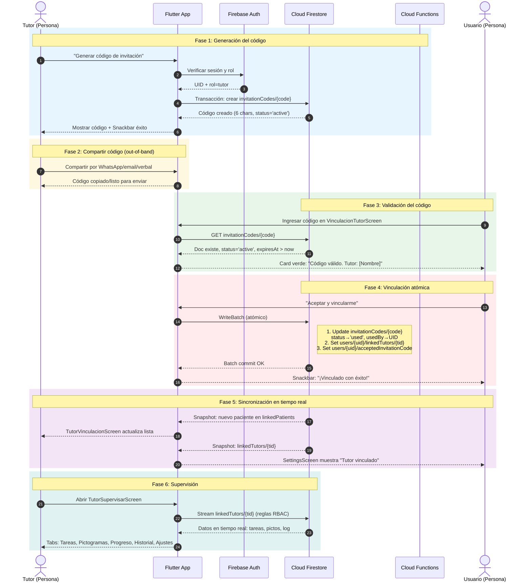

# D.3 Diagrama de Secuencia: Vinculación Tutor-Usuario

> **Versión ASCII (texto plano)** para copiar en draw.io / Lucidchart  
> **Versión Mermaid** al final para renderizar en GitHub, GitLab, Notion o [Mermaid Live Editor](https://mermaid.live)

---

## D.3.1 Secuencia detallada del flujo completo

```
┌──────────┐   ┌──────────┐   ┌────────────┐   ┌────────────┐   ┌────────────┐
│  Tutor   │   │  Flutter │   │   Firebase │   │  Firebase  │   │   Google   │
│ (Persona)│   │   App    │   │   Auth     │   │  Firestore │   │   Cloud    │
│          │   │          │   │            │   │            │   │ Functions  │
└────┬─────┘   └────┬─────┘   └─────┬──────┘   └─────┬──────┘   └─────┬──────┘
     │              │               │                │                │

[PHASE 1: GENERACIÓN DEL CÓDIGO DE INVITACIÓN]

     │              │               │                │                │
     │──"Generar───▶│               │                │                │
     │  código"     │               │                │                │
     │              │──onPressed───▶│                │                │
     │              │ _generateCode()│                │                │
     │              │               │                │                │
     │              │──POST /generate│                │                │
     │              │  (HTTPS Callable)               │                │
     │              │               │────────────────▶│                │
     │              │               │  Invoca         │                │
     │              │               │  AuthService    │                │
     │              │               │                │                │
     │              │               │──Verifica rol──▶│                │
     │              │               │  tutor?         │                │
     │              │               │◀───rol=tutor────│                │
     │              │               │                │                │
     │              │               │──Genera código──▶│               │
     │              │               │  (6 chars)      │                │
     │              │               │                │                │
     │              │               │──Crea doc───────▶│                │
     │              │               │  invitationCodes│                │
     │              │               │  /{code}        │                │
     │              │               │                │                │
     │              │◀──────────────│  Retorna código │                │
     │              │               │                │                │
     │◀─────────────│  Muestra código│               │                │
     │              │  + Snackbar OK │                │                │
     │              │               │                │                │

[PHASE 2: COMPARTIR CÓDIGO (OUT-OF-BAND)]

     │──"Comparte──▶│               │                │                │
     │  código"     │               │                │                │
     │  (WhatsApp,   │               │                │                │
     │   email, voz) │               │                │                │
     │              │               │                │                │

[PHASE 3: VALIDACIÓN DEL CÓDIGO POR EL USUARIO]

     │              │               │                │                │
     │              │   ┌───────────┘                │                │
     │              │   │  Usuario ingresa código    │                │
     │              │   │  en VinculacionTutorScreen │                │
     │              │   │                            │                │
     │              │   │──_validateCode()──────────▶│                │
     │              │   │  AuthService.validateCode()│                │
     │              │   │                            │                │
     │              │   │──GET invitationCodes/{code}│                │
     │              │   │                            │                │
     │              │   │◀──Doc existe───────────────│                │
     │              │   │  status='active'           │                │
     │              │   │  expiresAt > now           │                │
     │              │   │                            │                │
     │              │   │◀──Retorna tutorId,         │                │
     │              │   │  tutorName                 │                │
     │              │   │                            │                │
     │              │   │──Muestra card de éxito────▶│                │
     │              │   │  "Código válido.           │                │
     │              │   │   Tutor: [Nombre]"         │                │
     │              │   │                            │                │

[PHASE 4: ACEPTACIÓN Y VINCULACIÓN BIDIRECCIONAL]

     │              │   │                            │                │
     │              │   │──"Aceptar y vincularme"───▶│                │
     │              │   │  _acceptCode()             │                │
     │              │   │                            │                │
     │              │   │──Batch atómico────────────▶│                │
     │              │   │  (transacción Firestore)   │                │
     │              │   │                            │                │
     │              │   │  [Dentro del batch]:       │                │
     │              │   │  1. Update invitationCodes │                │
     │              │   │     /{code}                │                │
     │              │   │     status → 'used'        │                │
     │              │   │     usedBy → user.uid      │                │
     │              │   │     usedAt → serverTimestamp│               │
     │              │   │                            │                │
     │              │   │  2. Set users/{user.uid}   │                │
     │              │   │     /linkedTutors/{tutorId}│                │
     │              │   │     tutorId, linkedAt,     │                │
     │              │   │     status='active'        │                │
     │              │   │                            │                │
     │              │   │  3. Set users/{user.uid}   │                │
     │              │   │     acceptedInvitationCode │                │
     │              │   │     → {code}               │                │
     │              │   │                            │                │
     │              │   │◀──Batch commit OK──────────│                │
     │              │   │                            │                │
     │              │   │──Snackbar éxito───────────▶│                │
     │              │   │  "¡Vinculado con éxito!"   │                │
     │              │   │                            │                │

[PHASE 5: SINCRONIZACIÓN EN TIEMPO REAL]

     │              │   │                            │                │
     │              │   │  [Firestore emite snapshot]│                │
     │              │   │  a todos los listeners:    │                │
     │              │   │                            │                │
     │              │◀──│  StreamBuilder en          │                │
     │              │   │  TutorVinculacionScreen    │                │
     │              │   │  recibe nuevo paciente     │                │
     │              │   │                            │                │
     │◀─────────────│   │  Lista actualizada de      │                │
     │  "Nuevo      │   │  pacientes vinculados"     │                │
     │  usuario"    │   │                            │                │
     │              │   │◀──StreamBuilder en         │                │
     │              │   │  SettingsScreen            │                │
     │              │   │  recibe tutor vinculado    │                │
     │              │   │                            │                │
     │              │   │──UI actualizada───────────▶│                │
     │              │   │  "Tutor vinculado: [Name]" │                │
     │              │   │                            │                │

[PHASE 6: SUPERVISIÓN (POST-VINCULACIÓN)]

     │──"Abre panel──│               │                │                │
     │  de tutor"   │               │                │                │
     │              │──Navega a─────▶│                │                │
     │              │ TutorSupervisar│                │                │
     │              │               │                │                │
     │              │──GET linkedTutors/{tutorId}────▶│               │
     │              │  (reglas: tutor puede leer)     │               │
     │              │               │                │                │
     │              │◀───Datos del usuario────────────│                │
     │              │   (tareas, pictogramas, log)    │                │
     │              │   (solo si status='active')     │                │
     │              │               │                │                │
     │◀─────────────│  Muestra tabs: Tareas,         │                │
     │              │  Pictogramas, Progreso,         │                │
     │              │  Historial, Ajustes             │                │
     │              │               │                │                │
```

---

## D.3.2 Descripción de cada fase

| Fase | Actor | Acción | Resultado |
|------|-------|--------|-----------|
| **1** | Tutor | Genera código de 6 caracteres desde `TutorVinculacionScreen` | Código activo en Firestore `invitationCodes/{code}` con TTL de 7 días |
| **2** | Tutor | Comparte el código por medio externo (WhatsApp, email, verbal) | El usuario conoce el código |
| **3** | Usuario | Ingresa el código en `VinculacionTutorScreen` | Sistema valida: existe, está activo, no expiró. Muestra nombre del tutor |
| **4** | Usuario | Toca "Aceptar y vincularme" | **Batch atómico** en Firestore: marca código como `used`, crea `linkedTutors` en usuario, guarda `acceptedInvitationCode` |
| **5** | Sistema | Firestore emite snapshots a listeners | `TutorVinculacionScreen` muestra nuevo paciente. `SettingsScreen` del usuario muestra tutor vinculado |
| **6** | Tutor | Abre `TutorSupervisarScreen` | Accede en tiempo real a tareas, pictogramas, progreso, historial y ajustes del usuario vinculado |

---

## D.3.3 Versión Mermaid (renderizable)

Copia el siguiente bloque en [Mermaid Live Editor](https://mermaid.live) o en cualquier plataforma que soporte Mermaid.



**Instrucciones para renderizar:**
1. Copia todo el bloque `sequenceDiagram ...`
2. Pégalo en [Mermaid Live Editor](https://mermaid.live)
3. Descarga el PNG/SVG generado
4. O pégalo directamente en un archivo `.md` de GitHub/GitLab (se renderiza automáticamente)

---

*Fin del Anexo D.3 — Secuencia Vinculación Tutor-Usuario*
