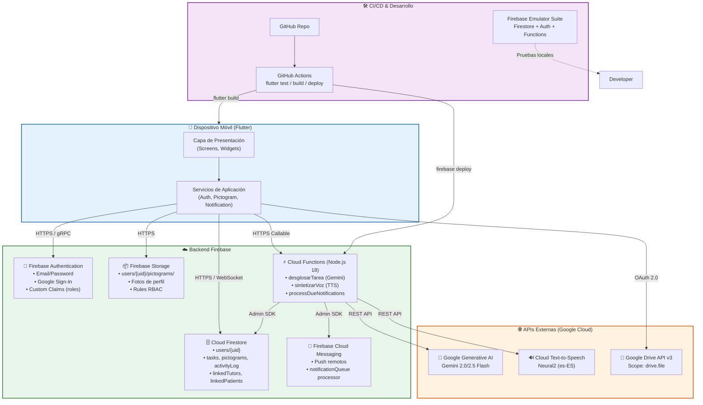

# D.4 Diagrama de Despliegue (Infraestructura Firebase)

> **Versión ASCII (texto plano)** para copiar en draw.io / Lucidchart  
> **Versión Mermaid** al final para renderizar en GitHub, GitLab, Notion o [Mermaid Live Editor](https://mermaid.live)

---

## D.4.1 Arquitectura de despliegue completa

```
┌─────────────────────────────────────────────────────────────────────────────┐
│                    DISPOSITIVO MÓVIL (Cliente)                               │
│  ┌─────────────────────────────────────────────────────────────────────┐   │
│  │  Aplicación Flutter (Android / iOS)                                  │   │
│  │  ┌─────────────┐  ┌─────────────┐  ┌─────────────┐  ┌────────────┐ │   │
│  │  │   Auth      │  │   Firestore │  │   Storage   │  │  Functions │ │   │
│  │  │   SDK       │  │   SDK       │  │   SDK       │  │  (HTTPS)   │ │   │
│  │  └──────┬──────┘  └──────┬──────┘  └──────┬──────┘  └─────┬──────┘ │   │
│  │         │                │                │               │        │   │
│  │  ┌──────┴────────────────┴────────────────┴───────────────┘        │   │
│  │  │                    Servicios de Aplicación                       │   │
│  │  │  (AuthService, PictogramService, NotificationService, etc.)      │   │
│  │  └─────────────────────────────────────────────────────────────────┘   │   │
│  │         │                                                             │   │
│  │  ┌──────┴──────────────────────────────────────────────────────────┐  │   │
│  │  │                    Capa de Presentación (UI)                     │  │   │
│  │  │  (Screens, Widgets, Animations, State Management)                │  │   │
│  │  └──────────────────────────────────────────────────────────────────┘  │   │
│  └─────────────────────────────────────────────────────────────────────┘   │
│         │                    │                    │                         │
│         │ HTTPS / gRPC       │ HTTPS / WebSocket  │ HTTPS                   │
│         │                    │                    │                         │
└─────────┼────────────────────┼────────────────────┼─────────────────────────┘
          │                    │                    │
          ▼                    ▼                    ▼
┌─────────────────────────────────────────────────────────────────────────────┐
│                         BACKEND (Firebase/Google Cloud)                      │
│                                                                              │
│  ┌─────────────────────────────────────────────────────────────────────┐    │
│  │  FIREBASE AUTHENTICATION                                             │    │
│  │  ┌─────────────────────────────────────────────────────────────┐    │    │
│  │  │  • Email/Password (Firebase Auth)                              │    │    │
│  │  │  • Google Sign-In (OAuth 2.0)                                  │    │    │
│  │  │  • Anonymous Auth (para onboarding sin registro)               │    │    │
│  │  │  • Custom Claims (roles: tutor | usuario)                      │    │    │
│  │  └─────────────────────────────────────────────────────────────┘    │    │
│  └─────────────────────────────────────────────────────────────────────┘    │
│                                                                              │
│  ┌─────────────────────────────────────────────────────────────────────┐    │
│  │  CLOUD FIRESTORE (NoSQL Documental)                                  │    │
│  │  ┌─────────────────────────────────────────────────────────────┐    │    │
│  │  │  Region: us-central1 (o la más cercana al usuario)           │    │    │
│  │  │  Modo: Native (no Datastore mode)                            │    │    │
│  │  │  Colecciones: users, invitationCodes, notificationQueue      │    │    │
│  │  │  Subcolecciones: tasks, pictograms, pictogramSettings,       │    │    │
│  │  │                  activityLog, linkedTutors, linkedPatients   │    │    │
│  │  │  Índices: Compuestos para queries de tutor y ordenación      │    │    │
│  │  │  Reglas: RBAC basado en roles y vinculación                  │    │    │
│  │  └─────────────────────────────────────────────────────────────┘    │    │
│  └─────────────────────────────────────────────────────────────────────┘    │
│                                                                              │
│  ┌─────────────────────────────────────────────────────────────────────┐    │
│  │  FIREBASE STORAGE (Objetos)                                          │    │
│  │  ┌─────────────────────────────────────────────────────────────┐    │    │
│  │  │  Bucket: [project-id].appspot.com                             │    │    │
│  │  │  Path: users/{uid}/pictograms/{filename}.jpg                  │    │    │
│  │  │  Rules: Lectura por usuario autenticado                       │    │    │
│  │  │         Escritura por owner o linkedTutor                     │    │    │
│  │  │  Metadata: uploadedBy, createdAt (auditoría)                  │    │    │
│  │  └─────────────────────────────────────────────────────────────┘    │    │
│  └─────────────────────────────────────────────────────────────────────┘    │
│                                                                              │
│  ┌─────────────────────────────────────────────────────────────────────┐    │
│  │  FIREBASE CLOUD FUNCTIONS (Node.js 18)                               │    │
│  │  ┌─────────────────────────────────────────────────────────────┐    │    │
│  │  │  Function: desglosarTarea                                     │    │    │
│  │  │  Trigger: HTTPS Callable                                      │    │    │
│  │  │  Runtime: Node.js 18                                          │    │    │
│  │  │  Memoria: 256MB                                               │    │    │
│  │  │  Timeout: 10s                                                 │    │    │
│  │  │  Dependencias: Google Generative AI (Gemini)                  │    │    │
│  │  │  Input: {tarea, tiempoDisponible}                             │    │    │
│  │  │  Output: [{titulo, tiempo_estimado}]                          │    │    │
│  │  │                                                               │    │    │
│  │  │  Function: sintetizarVoz                                      │    │    │
│  │  │  Trigger: HTTPS Callable                                      │    │    │
│  │  │  Dependencias: Google Cloud Text-to-Speech API                │    │    │
│  │  │  Input: {texto, vozId}                                        │    │    │
│  │  │  Output: {audioContent: base64}                               │    │    │
│  │  │                                                               │    │    │
│  │  │  Function: processDueNotifications                            │    │    │
│  │  │  Trigger: Cloud Scheduler (cron cada 1 minuto)                │    │    │
│  │  │  Dependencias: Firebase Admin SDK, FCM                        │    │    │
│  │  │  Acción: Procesa notificationQueue y envía FCM                │    │    │
│  │  └─────────────────────────────────────────────────────────────┘    │    │
│  └─────────────────────────────────────────────────────────────────────┘    │
│                                                                              │
│  ┌─────────────────────────────────────────────────────────────────────┐    │
│  │  FIREBASE CLOUD MESSAGING (FCM)                                      │    │
│  │  ┌─────────────────────────────────────────────────────────────┐    │    │
│  │  │  Canal: notificationQueue → Cloud Function → FCM → Device     │    │    │
│  │  │  Payload: {taskTitle, dueDate, reminderMinutes}               │    │    │
│  │  │  Topics: No se usan topics (mensajes directos por token)      │    │    │
│  │  └─────────────────────────────────────────────────────────────┘    │    │
│  └─────────────────────────────────────────────────────────────────────┘    │
│                                                                              │
│  ┌─────────────────────────────────────────────────────────────────────┐    │
│  │  SERVICIOS EXTERNOS (Google Cloud APIs)                              │    │
│  │  ┌─────────────────────────┐  ┌─────────────────────────────────┐  │    │
│  │  │ Google Cloud Text-to-   │  │ Google Drive API (v3)           │  │    │
│  │  │ Speech API              │  │ Scope: drive.file               │  │    │
│  │  │ Modelo: Neural2 (es-ES) │  │ Operaciones: backup/restore     │  │    │
│  │  │ Voz: neural2-f          │  │ Formato: JSON + imágenes ZIP    │  │    │
│  │  └─────────────────────────┘  └─────────────────────────────────┘  │    │
│  │  ┌─────────────────────────┐                                        │    │
│  │  │ Google Generative AI    │                                        │    │
│  │  │ Modelo: Gemini 2.0/2.5  │                                        │    │
│  │  │ Flash                   │                                        │    │
│  │  └─────────────────────────┘                                        │    │
│  └─────────────────────────────────────────────────────────────────────┘    │
│                                                                              │
└─────────────────────────────────────────────────────────────────────────────┘

┌─────────────────────────────────────────────────────────────────────────────┐
│                         CI/CD Y DESARROLLO                                   │
│  ┌─────────────────┐  ┌─────────────────┐  ┌─────────────────────────────┐   │
│  │   GitHub        │  │  GitHub Actions │  │   Firebase Emulator Suite   │   │
│  │   (Repositorio) │  │  (CI/CD)        │  │   (Pruebas locales)         │   │
│  │                 │  │  • flutter test │  │   • Firestore emulator      │   │
│  │  Organizate/    │  │  • flutter build│  │   • Auth emulator           │   │
│  │  simple         │  │  • firebase deploy│  │   • Functions emulator      │   │
│  └─────────────────┘  └─────────────────┘  └─────────────────────────────┘   │
└─────────────────────────────────────────────────────────────────────────────┘
```

---

## D.4.2 Flujo de datos en la infraestructura

```
[Usuario abre app]
    ↓
[Firebase Auth] → Verifica JWT del token de sesión
    ↓
[Firestore] → Sincronización en tiempo real de:
    • Documento del usuario (role, nombre, avatar, puntos)
    • Subcolección tasks (pendientes, completadas)
    • Subcolección pictogramSettings (feature flags)
    • Subcolección pictograms (personalizados)
    ↓
[Firebase Storage] → Descarga bajo demanda:
    • Imágenes de pictogramas personalizados (lazy loading)
    • Fotos de perfil
    ↓
[Cloud Functions] → Invocación bajo demanda:
    • desglosarTarea() → Gemini AI → retorna micro-pasos
    • sintetizarVoz() → Google TTS → retorna audio base64
    ↓
[FCM] → Notificaciones push programadas:
    • Recordatorios de tareas (Cloud Scheduler → FCM → dispositivo)
    • Fin de Pomodoro (local notification + FCM fallback)
    ↓
[Google Drive API] → Operaciones manuales del usuario:
    • Backup: JSON de configuración + imágenes → carpeta Simple_App_Backup
    • Restore: Descarga desde Drive → aplica a Firestore + almacenamiento local
```

---

## D.4.3 Versión Mermaid (renderizable)

Copia el siguiente bloque en [Mermaid Live Editor](https://mermaid.live) o en cualquier plataforma que soporte Mermaid.



**Instrucciones para renderizar:**
1. Copia todo el bloque `graph TB ...`
2. Pégalo en [Mermaid Live Editor](https://mermaid.live)
3. Descarga el PNG/SVG generado
4. O pégalo directamente en un archivo `.md` de GitHub/GitLab (se renderiza automáticamente)

---

*Fin del Anexo D.4 — Diagrama de Despliegue*
