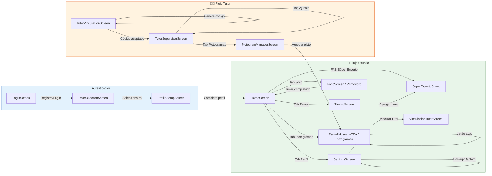

# D.5 Mockups de Interfaz de Usuario

> **Versión ASCII (texto plano)** con especificaciones técnicas exactas de widgets, colores, padding y tipografía.  
> **Versión Mermaid** al final: diagrama de flujo de navegación entre las 3 pantallas principales.

---

## D.5.1 Pantalla de Pictogramas (Tablero TEA - PantallaUsuarioTEA)

```
┌─────────────────────────────────────────┐
│  ┌─────┐         MI DÍA          [⚙️] [➕] [⏱️] │
│  │ SOS │                              │
│  └─────┘                              │
├─────────────────────────────────────────┤
│ ┌─────────┐ ┌─────────┐ ┌─────────┐ ┌─────────┐ │
│ │ MI      │ │ COMIDA  │ │EMOCIONES│ │ACCIONES │ │
│ │ RUTINA  │ │         │ │         │ │         │ │
│ └─────────┘ └─────────┘ └─────────┘ └─────────┘ │
├─────────────────────────────────────────┤
│  ┌─────────────────────────────────┐    │
│  │  ☀️ RUTINA DE MAÑANA            │    │
│  │                                 │    │
│  │  ┌────┐  ┌────┐  ┌────┐        │    │
│  │  │ 🚿 │  │ 🎒 │  │ 🪥 │        │    │
│  │  │    │  │    │  │    │        │    │
│  │  │DES-│  │COLE│  │DIEN│        │    │
│  │  │PERT│  │GIO │  │TES │        │    │
│  │  └────┘  └────┘  └────┘        │    │
│  │                                 │    │
│  │  ┌────┐  ┌────┐  ┌────┐        │    │
│  │  │ 🚽 │  │ 👕 │  │ 🍽️ │        │    │
│  │  │    │  │    │  │    │        │    │
│  │  │BAÑO│  │VEST│  │DESA│        │    │
│  │  │    │  │IR  │  │YUNO│        │    │
│  │  └────┘  └────┘  └────┘        │    │
│  └─────────────────────────────────┘    │
├─────────────────────────────────────────┤
│  [🔔 AYUDA]                            │
└─────────────────────────────────────────┘
│  🏠    📋    🖼️    ⏱️    👤          │
└─────────────────────────────────────────┘
```

### Especificaciones técnicas del mockup

**AppBar:**
- Leading: Container 48x48, BorderRadius 12, Color: Colors.red,
  Text: 'SOS', FontWeight.w900, FontSize 13, LetterSpacing 1.5
- Title: 'MI DÍA', FontSize 20 (titleLarge), FontWeight.w800,
  Color: Theme.primary, LetterSpacing 2.0
- Actions: IconButton tune (organizar), IconButton add_photo_alternate
  (crear pictograma), ContadorTransicion widget (semaforo circular 44x44)

**TabBar:**
- 4 tabs: MI RUTINA | COMIDA | EMOCIONES | ACCIONES
- IndicatorColor: Theme.primary, IndicatorWeight: 3
- IndicatorSize: TabBarIndicatorSize.label
- LabelColor: Theme.primary, UnselectedLabelColor: Theme.onSurfaceVariant
- LabelStyle: FontWeight.w800, FontSize 11, LetterSpacing 0.8

**Grid de Pictogramas:**
- CrossAxisCount: 3 (tres columnas)
- CrossAxisSpacing: 12, MainAxisSpacing: 12
- ChildAspectRatio: 0.82
- Padding: EdgeInsets.fromLTRB(16, 8, 16, 16)

**Tarjeta de Pictograma:**
- Container: BorderRadius 24, Color: Theme.surface
- Border: 1.0-1.5px, Color: Theme.outlineVariant (o secondary para personalizados)
- BoxShadow: Color.withAlpha(0.06), BlurRadius 10, Offset(0, 4)
- Imagen: Padding 10,10,10,6 → Expanded con SVG o Image.network
- Label: Container con Color primaryContainer/secondaryContainer at 15-20%,
  FontSize 8-9, FontWeight.w800, Color primary/secondary
- Para personalizados: Icon(Icons.photo_camera, size 8) + espacio 3px

**Header de Rutina (dentro de _GridCategoriaDisplay):**
- Container: Padding 14x8, BorderRadius 10,
  Color: primaryContainer.withAlpha(0.35)
- Icon: iconoRutina, Color primary, Size 16
- Text: 'RUTINA DE ${nombreRutina}', FontSize labelMedium,
  FontWeight.w800, Color primary, LetterSpacing 0.8

**Botón de Ayuda (bottom):**
- ElevatedButton.icon: Color errorContainer, Foreground onErrorContainer
- Padding vertical 10, BorderRadius 14
- Icon: Icons.warning_rounded, Size 20
- Label: 'AYUDA', FontWeight.w800, FontSize 13, LetterSpacing 1.5

**BottomNavigationBar (CustomNavBar):**
- Type: BottomNavigationBarType.fixed
- SelectedItemColor: Colors.blue.shade700
- UnselectedItemColor: Colors.grey.shade500
- FontSize: 12 (selected y unselected)
- BackgroundColor: Colors.white, Elevation 8

---

## D.5.2 Panel del Tutor (TutorSupervisarScreen)

```
┌─────────────────────────────────────────┐
│  [👤]  María González ▼          [⚙️]  │
├─────────────────────────────────────────┤
│  ┌─────────────────────────────────────┐│
│  │  📋 TAREAS           [+] Agregar    ││
│  │                                     ││
│  │  ┌─────────────────────────────┐   ││
│  │  │ [⚪] Estudiar matemáticas    │   ││
│  │  │     📚 Estudios · Hoy 15:00 │   ││
│  │  └─────────────────────────────┘   ││
│  │  ┌─────────────────────────────┐   ││
│  │  │ [✅] Lavar los platos       │   ││
│  │  │     🏠 Hogar · Completada   │   ││
│  │  └─────────────────────────────┘   ││
│  │  ┌─────────────────────────────┐   ││
│  │  │ [🗑️] Hacer la cama          │   ││
│  │  │     🏠 Hogar · Eliminada    │   ││
│  │  └─────────────────────────────┘   ││
│  └─────────────────────────────────────┘│
├─────────────────────────────────────────┤
│  Tareas  🖼️  Progreso  📜  Ajustes     │
└─────────────────────────────────────────┘
```

### Especificaciones técnicas del mockup

**AppBar:**
- BackgroundColor: Colors.transparent, Elevation: 0
- Leading: CircleAvatar (radius 18, backgroundColor grey.shade200,
  backgroundImage: AssetImage('assets/avatars/$avatar.png') o Icon(Icons.person))
- Title: GestureDetector → Row con Text(_patientName, FontWeight.w600) + Icon(Icons.arrow_drop_down)
  (solo si _patients.length > 1)
- Actions: IconButton(Icons.settings_outlined) → SettingsScreen

**Selector de Usuario (BottomSheet):**
- Shape: RoundedRectangleBorder, BorderRadius.vertical(top: Radius.circular(20))
- Children: ListTile por cada paciente vinculado
  - Leading: CircleAvatar (radius 20, backgroundImage o Icon)
  - Title: Text(name, FontWeight.w500)
  - Subtitle: Text(email, FontSize 12)
  - Trailing: isSelected ? Icon(Icons.check_circle, color: Colors.green)
                          : Icon(Icons.radio_button_unchecked, color: Colors.grey)

**IndexedStack (5 tabs):**
- Index: _currentIndex
- Children con ValueKey('tasks_$patientId'), ValueKey('pictos_$patientId'), etc.
- Cada tab se reconstruye completamente al cambiar de paciente (ValueKey)

**Tab _TutorTasksTab:**
- FloatingActionButton.extended: onPressed _addTask,
  Icon(Icons.add), Label: 'Agregar tarea'
- StreamBuilder<QuerySnapshot> de _tasksRef
- Secciones: 'Pendientes (N)' [Colors.blueAccent],
  'Completadas (N)' [Colors.green],
  'Eliminadas por el usuario (N)' [Colors.grey]
- _SupervisionTaskTile: Card con Checkbox, título, categoría con chip de color,
  fecha, IconButton delete

**Tab _TutorPictogramsTab:**
- FloatingActionButtons: 'Organizar pictogramas' (heroTag, naranja) +
  'Agregar' (heroTag, primario)
- StreamBuilder<List<PictogramaPersonalizado>>
- GridView 3 columnas, aspect ratio 0.85
- _SupervisionPictoCard: Imagen + etiqueta + IconButton delete

**Tab ProgresoScreen:**
- userId: patientId (para mostrar datos del usuario seleccionado)
- Gráficos: tareas por categoría, uso de pictogramas, sesiones Pomodoro semanales

**Tab _TutorHistorialTab:**
- SliverList con _StatsCard (4 chips: sesiones, minutos, racha, puntos)
- StreamBuilder de ActivityLogService.getStream(patientId)
- Cada item: Container con fondo color.withAlpha(0.06), borde del mismo color,
  Icon en círculo, título, descripción, fecha formateada

**Tab _TutorConfigTab:**
- StreamBuilder de pictogramSettings/_features
- _FeatureToggleTile x5: Inicio, Tareas, Pictogramas, Foco, Perfil
- SwitchListTile con icono circular, título, subtítulo descriptivo
- Modo Kiosk: StreamBuilder<bool> + _FeatureToggleTile
- Contacto de emergencia: 2 TextFields + ElevatedButton.icon Guardar

**BottomNavigationBar (NavigationBar):**
- SelectedIndex: _currentIndex
- Destinations:
  1. NavigationDestination(Icons.task_alt_outlined / Icons.task_alt, 'Tareas')
  2. NavigationDestination(Icons.image_outlined / Icons.image_rounded, 'Pictogramas')
  3. NavigationDestination(Icons.bar_chart_outlined / Icons.bar_chart_rounded, 'Progreso')
  4. NavigationDestination(Icons.history, 'Historial')
  5. NavigationDestination(Icons.tune_outlined / Icons.tune_rounded, 'Ajustes')

---

## D.5.3 Temporizador Pomodoro (FocoScreen)

```
┌─────────────────────────────────────────┐
│  ⬅️  Modo Foco                         │
├─────────────────────────────────────────┤
│                                         │
│           ┌─────────────┐               │
│           │             │               │
│           │    25:00    │               │
│           │             │               │
│           │  ┌───────┐  │               │
│           │  │       │  │               │
│           │  │  🍅   │  │               │
│           │  │       │  │               │
│           │  └───────┘  │               │
│           │             │               │
│           └─────────────┘               │
│                                         │
│     [══════════════════════]            │
│          100% completado                │
│                                         │
│   ┌─────────────────────────────────┐   │
│   │        [ ▶️ INICIAR ]           │   │
│   └─────────────────────────────────┘   │
│                                         │
│   ┌──────┐  ┌──────┐  ┌──────┐         │
│   │ ⏸️   │  │ ⏹️   │  │ ⏭️   │         │
│   │Pausa │  │Detener│  │Saltar│         │
│   └──────┘  └──────┘  └──────┘         │
│                                         │
│   🔊 Sonido:  Campanilla clásica        │
│   📳 Vibración:  Desactivada            │
│                                         │
│   Sesiones completadas: 12              │
│   Minutos de foco: 300                  │
│                                         │
└─────────────────────────────────────────┘
│  🏠    📋    🖼️    ⏱️    👤          │
└─────────────────────────────────────────┘
```

### Especificaciones técnicas del mockup

**AppBar:**
- Leading: BackButton o IconButton(Icons.arrow_back)
- Title: 'Modo Foco', FontWeight.bold
- BackgroundColor: Colors.transparent, Elevation 0

**Timer Principal:**
- CustomPaint circular o Stack con CircularProgressIndicator
- Diámetro: ~220px
- Color del track: Theme.outlineVariant.withAlpha(0.2)
- Color del progreso: Theme.primary (o Colors.deepOrange para Pomodoro)
- StrokeWidth: 8-12
- Centro: Column con Text('25:00', FontSize 48, FontWeight.bold) +
  Icon(Icons.local_fire_department, size 48, Color: Colors.deepOrange)

**Barra de progreso lineal:**
- LinearProgressIndicator o CustomPainter
- Valor: (totalDuration - remaining) / totalDuration
- Altura: 8px, BorderRadius 4

**Botón Principal:**
- ElevatedButton: Padding vertical 16, BorderRadius 14
- BackgroundColor: Theme.primary
- ForegroundColor: Colors.white
- Text: 'INICIAR' | 'REANUDAR' | 'PAUSAR' (según PomodoroStatus)
- FontWeight.w600, FontSize 16

**Botones Secundarios:**
- 3 IconButton o ElevatedButton.icon
- Iconos: Icons.pause (Pausa), Icons.stop (Detener), Icons.skip_next (Saltar)
- Labels: FontSize 12, Color: Theme.onSurfaceVariant

**Configuración:**
- ListTile con leading Icon(Icons.volume_up, color: Colors.grey)
- Title: 'Sonido al terminar Pomodoro'
- Trailing: DropdownButton con opciones ('Campanilla clásica', 'Notificación')
- SwitchListTile: 'Vibración al terminar Pomodoro'

**Estadísticas:**
- Text('Sesiones completadas: $focusSessionsCompleted')
- Text('Minutos de foco: $totalFocusMinutes')
- FontSize 14, Color: Theme.onSurfaceVariant

**Estados del Timer:**
- idle: Timer muestra duración configurada (default 25:00), botón INICIAR
- running: Timer decrementa cada segundo, botón PAUSAR, progreso avanza
- paused: Timer congela en remaining, botón REANUDAR, progreso pausado
- finished: Timer en 00:00, SnackBar '¡Pomodoro completado!', sonido/vibración,
  ActivityLogService.log(pomodoroCompleted)

---

## D.5.4 Versión Mermaid: Flujo de Navegación Entre Pantallas

Este diagrama muestra cómo el usuario navega entre las 3 pantallas mockup y el resto del sistema.



**Instrucciones para renderizar:**
1. Copia todo el bloque `graph LR ...`
2. Pégalo en [Mermaid Live Editor](https://mermaid.live)
3. Descarga el PNG/SVG generado

---

## D.5.5 Tabla comparativa de las 3 pantallas mockup

| Aspecto | Pictogramas (TEA) | Panel Tutor | Pomodoro (Foco) |
|---------|-------------------|-------------|-----------------|
| **Usuario objetivo** | Persona TEA (comunicación) | Tutor (supervisión) | Persona TDAH (foco) |
| **Complejidad visual** | Mínima (iconos grandes, poco texto) | Media (listas, chips, tabs) | Baja (timer central, controles grandes) |
| **Elemento central** | Grid de pictogramas 3x3 | IndexedStack con 5 tabs | Timer circular con progreso |
| **Interacción principal** | Tap = TTS, Long-press = editar | Tab switching, checkboxes, toggles | Tap = Start/Pause/Stop |
| **Feedback inmediato** | Audio TTS + animación de pulsación | Checkbox animado + Snackbar | Sonido/vibración al terminar |
| **Acceso de tutor** | No (solo via panel tutor) | Sí (pantalla exclusiva) | Solo lectura en Progreso |
| **Estado en tiempo real** | Stream de pictogramas | Streams de tareas, pictos, log, flags | ChangeNotifier (local) + persistencia |
| **Personalización** | Feature flags por categoría | Feature flags por paciente | Duración, sonido, vibración |

---

*Fin del Anexo D.5 — Mockups de Interfaz de Usuario*
