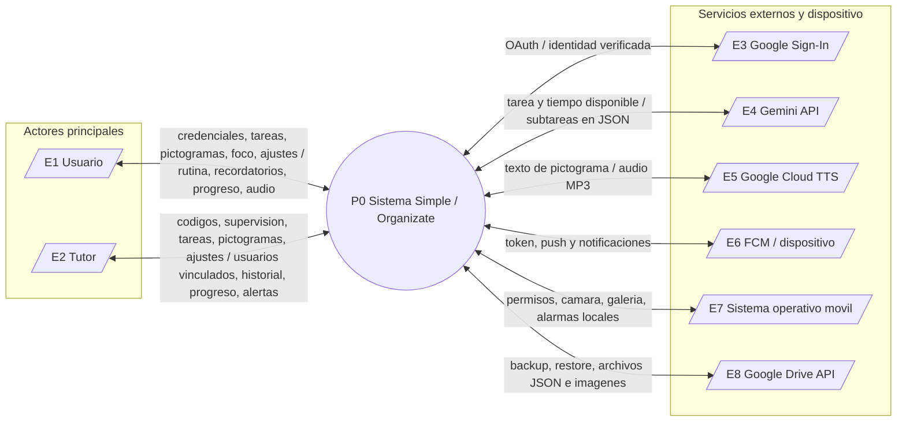
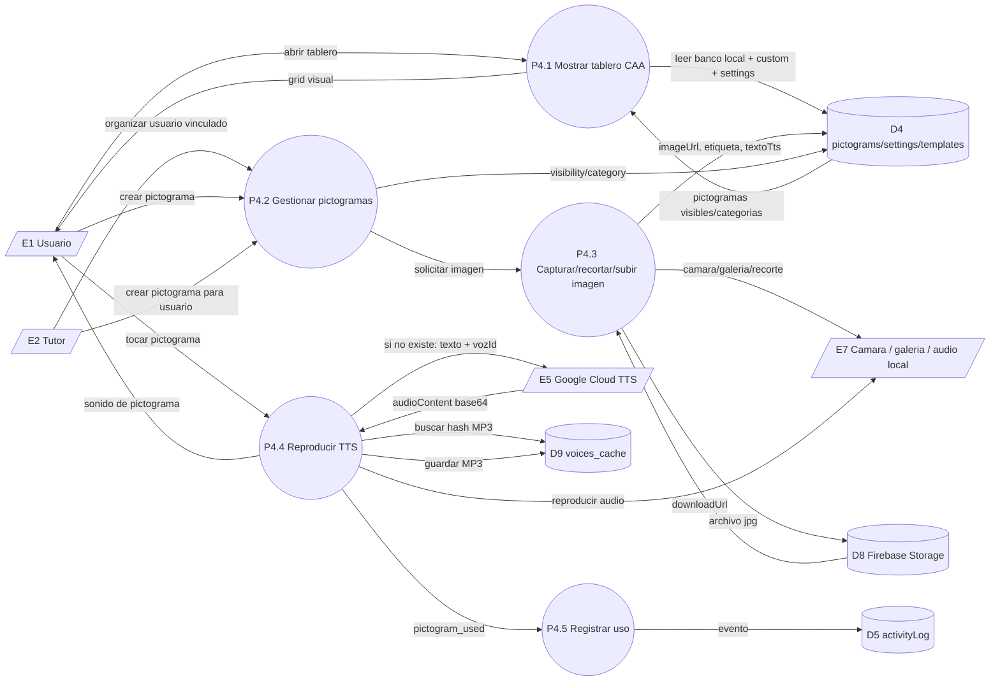

# D6 - Diagrama de Flujo de Datos (DFD)

Este documento describe el flujo de datos del sistema **Simple / Organizate** a partir de la implementacion actual en Flutter, Firebase y Cloud Functions.

## D6.1 Alcance del DFD

El DFD considera como sistema a la aplicacion movil Flutter junto con sus servicios Firebase asociados:

- Cliente Flutter: pantallas, widgets, servicios locales, SharedPreferences, cache local y notificaciones locales.
- Firebase: Authentication, Firestore, Storage, Cloud Functions y Firebase Cloud Messaging.
- Servicios externos: Google Sign-In, Google Drive API, Gemini API y Google Cloud Text-to-Speech.

No se modelan como procesos internos los widgets visuales individuales, salvo cuando representan una funcion de negocio clara.

## D6.2 Actores y entidades externas

| ID | Entidad | Descripcion |
|----|---------|-------------|
| E1 | Usuario | Persona neurodivergente que usa tareas, foco, pictogramas, perfil y comunicacion aumentativa. |
| E2 | Tutor | Supervisor que vincula usuarios, revisa progreso, administra tareas, pictogramas y configuracion. |
| E3 | Google Sign-In | Proveedor OAuth usado por Firebase Auth para ingreso con cuenta Google. |
| E4 | Gemini API | Servicio externo de IA usado por la Cloud Function `desglosarTarea`. |
| E5 | Google Cloud TTS | Servicio externo de sintesis de voz usado por la Cloud Function `sintetizarVoz`. |
| E6 | FCM / dispositivo | Canal de entrega de notificaciones push y recepcion en el dispositivo. |
| E7 | Sistema operativo movil | Permisos, alarmas exactas, vibracion, sonido, camara, galeria y notificaciones locales. |
| E8 | Google Drive API | Servicio externo usado para backup y restauracion de configuracion y pictogramas locales. |

## D6.3 Almacenes de datos

| ID | Almacen | Ubicacion real | Datos principales |
|----|---------|----------------|-------------------|
| D1 | Identidad Firebase | Firebase Auth | Sesion, email, proveedor, UID, displayName. |
| D2 | Usuarios y perfil | `users/{uid}` | Rol, nombre, avatar, puntos, racha, preferencias, tokens FCM, contacto de emergencia. |
| D3 | Tareas | `users/{uid}/tasks/{taskId}` | Texto, categoria, vencimiento, recordatorio, recurrencia, estado, soft-delete. |
| D4 | Pictogramas | `users/{uid}/pictograms`, `pictogramSettings`, `pictogramTemplates` | Pictogramas personalizados, overrides de visibilidad/categoria, flags de funciones. |
| D5 | Historial y progreso | `users/{uid}/activityLog`, campos agregados en `users/{uid}` | Eventos, puntos, racha, sesiones de foco, minutos totales. |
| D6 | Vinculacion tutor-usuario | `invitationCodes`, `users/{uid}/linkedTutors` | Codigos, tutorId, usuario vinculado, estado activo/usado/inactivo. |
| D7 | Cola de notificaciones | `users/{uid}/notificationQueue`, `users/{uid}.fcmTokens` | Recordatorios pendientes, fecha de ejecucion, estado, tokens del dispositivo. |
| D8 | Archivos Firebase Storage | `users/{uid}/pictograms`, `user_photos/{uid}/profile.jpg` | Imagenes de pictogramas y foto de perfil. |
| D9 | Datos locales del dispositivo | SharedPreferences, documentos locales, cache | Estado Pomodoro, fecha de backup, cache TTS, pictogramas descargados. |

## D6.4 DFD nivel 0 - Contexto del sistema



## D6.5 DFD nivel 1 - Procesos principales

```mermaid
flowchart TB
    Usuario[/E1 Usuario/]
    Tutor[/E2 Tutor/]
    GoogleAuth[/E3 Google Sign-In/]
    Gemini[/E4 Gemini API/]
    TTS[/E5 Google Cloud TTS/]
    FCM[/E6 FCM / dispositivo/]
    OS[/E7 Sistema operativo movil/]
    Drive[/E8 Google Drive API/]

    P1((P1 Autenticacion y onboarding))
    P2((P2 Gestion de tareas))
    P3((P3 Super Experto IA))
    P4((P4 Tablero CAA y pictogramas))
    P5((P5 Supervision y vinculacion))
    P6((P6 Progreso e historial))
    P7((P7 Notificaciones y recordatorios))
    P8((P8 Backup y restauracion))
    P9((P9 Modo foco / Pomodoro))

    D1[(D1 Firebase Auth)]
    D2[(D2 users/{uid})]
    D3[(D3 users/{uid}/tasks)]
    D4[(D4 pictograms/settings/templates)]
    D5[(D5 activityLog + metricas)]
    D6[(D6 invitationCodes + linkedTutors)]
    D7[(D7 notificationQueue + fcmTokens)]
    D8[(D8 Firebase Storage)]
    D9[(D9 datos locales/cache)]

    Usuario -->|"email/password, Google, rol, perfil"| P1
    Tutor -->|"email/password, Google, rol, perfil"| P1
    P1 -->|"OAuth"| GoogleAuth
    GoogleAuth -->|"credencial"| P1
    P1 -->|"crear/login sesion"| D1
    P1 -->|"leer/escribir rol, perfil, onboarding"| D2
    D1 -->|"authStateChanges UID"| P1
    D2 -->|"role, onboarding, profile"| P1
    P1 -->|"ruta usuario/tutor"| Usuario
    P1 -->|"ruta tutor"| Tutor

    Usuario -->|"crear, editar, completar, borrar tarea"| P2
    Tutor -->|"crear/editar tareas del usuario vinculado"| P2
    P2 -->|"CRUD tareas, soft-delete, recurrencia"| D3
    P2 -->|"puntos, streak"| D2
    P2 -->|"eventos task_created/completed/deleted"| D5
    P2 -->|"programar/cancelar recordatorio"| P7
    D3 -->|"snapshots tareas"| P2
    P2 -->|"lista de tareas y estados"| Usuario

    Usuario -->|"tarea compleja + tiempo"| P3
    P3 -->|"httpsCallable desglosarTarea"| Gemini
    Gemini -->|"pasos JSON"| P3
    P3 -->|"subtareas generadas"| D3
    P3 -->|"plan atomico"| Usuario

    Usuario -->|"usar tablero, crear pictograma"| P4
    Tutor -->|"gestionar pictogramas/visibilidad"| P4
    P4 -->|"captura/galeria/recorte"| OS
    P4 -->|"subir imagen"| D8
    P4 -->|"CRUD pictogramas y ajustes"| D4
    D4 -->|"pictogramas y settings"| P4
    P4 -->|"texto a voz"| TTS
    TTS -->|"audio MP3"| P4
    P4 -->|"cache de audio"| D9
    P4 -->|"pictogram_used/created/deleted"| D5
    P4 -->|"tablero visual + audio"| Usuario

    Tutor -->|"generar codigo, supervisar, desvincular"| P5
    Usuario -->|"aceptar codigo"| P5
    P5 -->|"crear/validar/usar codigo"| D6
    P5 -->|"leer usuario vinculado"| D2
    P5 -->|"leer/escribir tareas/pictogramas/config"| D3
    P5 -->|"leer/escribir tareas/pictogramas/config"| D4
    P5 -->|"leer historial y metricas"| D5
    P5 -->|"panel de supervision"| Tutor

    Usuario -->|"consultar progreso"| P6
    Tutor -->|"consultar progreso usuario vinculado"| P6
    P6 -->|"leer tareas"| D3
    P6 -->|"leer metricas agregadas"| D2
    P6 -->|"leer activityLog"| D5
    P6 -->|"graficos, puntos, racha, historial"| Usuario
    P6 -->|"graficos, puntos, racha, historial"| Tutor

    P7 -->|"guardar token FCM"| D2
    P7 -->|"crear/cancelar notificationQueue"| D7
    P7 -->|"alarma local, permiso exact alarm"| OS
    P7 -->|"push remoto"| FCM
    FCM -->|"mensaje foreground/background"| P7
    P7 -->|"notificacion visible"| Usuario
    P7 -->|"alerta tarea completada"| Tutor

    Usuario -->|"backup/restaurar"| P8
    P8 -->|"leer/aplicar settings"| D2
    P8 -->|"leer/escribir archivos locales"| D9
    P8 -->|"JSON e imagenes"| Drive
    Drive -->|"backup cloud"| P8
    P8 -->|"estado de sincronizacion"| Usuario

    Usuario -->|"iniciar/pausar/cancelar foco"| P9
    P9 -->|"estado timer"| D9
    P9 -->|"programar fin de Pomodoro"| P7
    P9 -->|"sesiones/minutos foco"| D2
    P9 -->|"pomodoro_completed"| D5
    P9 -->|"timer y aviso"| Usuario
```

## D6.6 DFD nivel 2 - Flujos criticos

### D6.6.1 Autenticacion, rol y navegacion

```mermaid
flowchart LR
    U[/Usuario o Tutor/]
    Login((P1.1 Login / registro))
    Role((P1.2 Seleccion de rol))
    Profile((P1.3 Perfil))
    Gate((P1.4 AuthGate / RoleDispatcher))

    Auth[(D1 Firebase Auth)]
    Users[(D2 users/{uid})]
    Google[/E3 Google Sign-In/]

    U -->|"email/password o Google"| Login
    Login -->|"OAuth si aplica"| Google
    Google -->|"credential"| Login
    Login -->|"crear/sesion UID"| Auth
    Login -->|"crear doc base"| Users
    Auth -->|"authStateChanges"| Gate
    Gate -->|"leer role/onboarding/profile"| Users
    Gate -->|"role ausente"| Role
    Role -->|"role tutor/usuario"| Users
    Gate -->|"perfil incompleto"| Profile
    Profile -->|"name/avatar/hasCompletedProfile"| Users
    Gate -->|"HomeScreen o TutorSupervisarScreen"| U
```

### D6.6.2 Vinculacion tutor-usuario

```mermaid
flowchart LR
    Tutor[/E2 Tutor/]
    Usuario[/E1 Usuario/]

    Gen((P5.1 Generar codigo))
    Validate((P5.2 Validar codigo))
    Accept((P5.3 Aceptar codigo))
    Supervise((P5.4 Supervisar usuario))

    Codes[(D6 invitationCodes)]
    Link[(D6 users/{patientId}/linkedTutors/{tutorId})]
    Users[(D2 users/{uid})]
    Tasks[(D3 tasks)]
    Pictos[(D4 pictograms/settings)]
    Logs[(D5 activityLog)]

    Tutor -->|"solicita codigo"| Gen
    Gen -->|"code, tutorId, status active, expiresAt"| Codes
    Gen -->|"codigo de 6 caracteres"| Tutor

    Usuario -->|"ingresa codigo"| Validate
    Validate -->|"leer codigo"| Codes
    Codes -->|"valid, tutorId, tutorName"| Validate
    Validate -->|"confirmacion"| Usuario

    Usuario -->|"aceptar vinculacion"| Accept
    Accept -->|"status used, usedBy"| Codes
    Accept -->|"status active"| Link
    Accept -->|"acceptedInvitationCode"| Users

    Tutor -->|"abre panel"| Supervise
    Supervise -->|"buscar codigos used por tutor"| Codes
    Supervise -->|"leer perfil usuario"| Users
    Supervise -->|"leer/escribir tareas"| Tasks
    Supervise -->|"leer/escribir pictogramas/config"| Pictos
    Supervise -->|"leer historial"| Logs
    Supervise -->|"panel con datos supervisados"| Tutor
```

### D6.6.3 Tareas, gamificacion, recurrencia y notificaciones

```mermaid
flowchart TB
    Usuario[/E1 Usuario/]
    Tutor[/E2 Tutor/]
    TaskUI((P2.1 Crear/editar/completar tarea))
    Streak((P2.2 Actualizar puntos y racha))
    Log((P2.3 Registrar actividad))
    Reminder((P7.1 Programar recordatorio))
    Scheduler((P7.2 processDueNotifications))
    Recurrence((P2.4 recreateRecurringTask))
    TutorPush((P7.3 notifyTutorOnTaskComplete))

    Tasks[(D3 users/{uid}/tasks)]
    Users[(D2 users/{uid})]
    Logs[(D5 activityLog)]
    Queue[(D7 notificationQueue)]
    FCM[/E6 FCM / dispositivo/]
    OS[/E7 Notificaciones locales/]

    Usuario -->|"accion sobre tarea"| TaskUI
    Tutor -->|"tarea supervisada"| TaskUI
    TaskUI -->|"set/update/delete/soft-delete"| Tasks
    TaskUI -->|"si dueDate + reminder"| Reminder
    Reminder -->|"zonedSchedule local"| OS
    Reminder -->|"doc pending runAt"| Queue

    TaskUI -->|"done false -> true"| Streak
    Streak -->|"points increment, streak transaction"| Users
    TaskUI -->|"evento de tarea"| Log
    Log -->|"task_created/completed/deleted"| Logs

    Tasks -->|"onUpdate done true + recurrence"| Recurrence
    Recurrence -->|"nueva tarea siguiente ciclo"| Tasks

    Tasks -->|"onUpdate done true"| TutorPush
    TutorPush -->|"leer linkedTutors y tokens"| Users
    TutorPush -->|"push task_completed"| FCM
    FCM -->|"alerta al tutor"| Tutor

    Queue -->|"collectionGroup pending runAt <= now"| Scheduler
    Scheduler -->|"leer fcmTokens"| Users
    Scheduler -->|"sendEachForMulticast"| FCM
    Scheduler -->|"status sent/failed/no_tokens"| Queue
    FCM -->|"recordatorio remoto"| Usuario
```

### D6.6.4 Pictogramas, tablero CAA y voz



### D6.6.5 Backup y restauracion

```mermaid
flowchart LR
    Usuario[/E1 Usuario/]
    Backup((P8.1 Backup a Drive))
    Restore((P8.2 Restaurar desde Drive))
    AuthDrive((P8.3 OAuth Drive))

    Users[(D2 users/{uid})]
    Local[(D9 SharedPreferences + archivos locales)]
    Drive[/E8 Google Drive API/]

    Usuario -->|"iniciar backup"| Backup
    Backup -->|"autenticar scope drive.file"| AuthDrive
    AuthDrive -->|"token OAuth"| Drive
    Backup -->|"leer configuracion"| Users
    Backup -->|"leer pictogramas locales y lastSync"| Local
    Backup -->|"settings_backup.json + pictogramas"| Drive
    Backup -->|"actualizar drive_last_sync"| Local
    Backup -->|"resultado"| Usuario

    Usuario -->|"iniciar restore"| Restore
    Restore -->|"autenticar scope drive.file"| AuthDrive
    Restore -->|"listar/descargar backup"| Drive
    Restore -->|"aplicar settings merge"| Users
    Restore -->|"guardar pictogramas locales"| Local
    Restore -->|"actualizar drive_last_sync"| Local
    Restore -->|"resultado restore"| Usuario
```

## D6.7 Diccionario de flujos de datos

| Flujo | Origen | Destino | Contenido |
|-------|--------|---------|-----------|
| Credenciales de acceso | Usuario/Tutor | Firebase Auth | Email/password o token de Google. |
| Perfil de usuario | Cliente Flutter | Firestore `users/{uid}` | Nombre, email, rol, avatar, onboarding, preferencias. |
| Estado de navegacion | Firebase Auth + Firestore | AuthGate | Sesion activa, rol, onboarding y perfil completo. |
| Codigo de invitacion | Tutor | `invitationCodes` | Codigo, tutorId, tutorName, status, fechas de uso/expiracion. |
| Vinculacion activa | Usuario | `linkedTutors` | tutorId, linkedAt, status `active`. |
| Tarea | Usuario/Tutor | `tasks` | Texto, categoria, dueDate, reminderMinutes, recurrence, done, deletedByUser. |
| Evento de actividad | App | `activityLog` | Tipo, descripcion, timestamp y metadata. |
| Puntos y racha | App | `users/{uid}` | Incrementos de puntos, streak, lastStreakDate. |
| Pictograma personalizado | App | Storage + Firestore | Imagen JPG, URL de descarga, etiqueta, textoTts, categoria. |
| Ajustes de pictograma | Usuario/Tutor | `pictogramSettings` | Categoria efectiva, visibilidad y flags `_features`. |
| Solicitud IA | App | Cloud Function / Gemini | Texto de tarea y tiempo disponible. |
| Respuesta IA | Gemini | App | Lista JSON de pasos `{titulo, tiempo_estimado}`. |
| Solicitud TTS | App | Cloud Function / Google TTS | Texto de pictograma y voz seleccionada. |
| Audio sintetizado | Google TTS | App | MP3 en Base64, guardado en cache local. |
| Token FCM | Dispositivo | `users/{uid}.fcmTokens` | Token del dispositivo para push remotas. |
| Recordatorio remoto | App | `notificationQueue` | taskId, taskTitle, runAt, status, dueDate, reminderMinutes. |
| Push de recordatorio | Cloud Functions | FCM / dispositivo | Titulo, cuerpo y data de tarea. |
| Estado Pomodoro | PomodoroService | SharedPreferences | Duracion total, restante, estado y endTime. |
| Estadisticas foco | FocoScreen | `users/{uid}` + `activityLog` | Sesiones completadas, minutos totales y evento `pomodoro_completed`. |
| Backup | App | Google Drive | JSON de configuracion y archivos JPG locales. |
| Restore | Google Drive | App + Firestore | Settings restaurados y pictogramas descargados. |

## D6.8 Reglas de seguridad y control de acceso reflejadas en el DFD

- El UID autenticado en Firebase Auth es la base de identidad para todos los accesos.
- El rol se almacena en `users/{uid}.role` y solo puede ser `tutor` o `usuario`.
- El tutor no accede a cualquier usuario: las reglas validan la existencia de `users/{patientId}/linkedTutors/{tutorId}` con `status == active`.
- El usuario escribe sus propias tareas, pictogramas, preferencias y logs; el tutor puede supervisar y modificar datos del usuario vinculado donde las reglas lo permiten.
- `activityLog` es de escritura del usuario y lectura supervisada del tutor. No se contempla eliminacion desde la regla principal.
- Las tareas eliminadas por el usuario usan `deletedByUser: true` para conservar historial visible al tutor.
- Los pictogramas personalizados guardan metadatos en Firestore y archivos en Storage.
- La API key de Gemini no viaja al cliente: la app llama `desglosarTarea` en Cloud Functions, y la funcion invoca Gemini usando secret de Firebase.
- La sintesis de voz remota se encapsula en `sintetizarVoz`; el cliente recibe audio, no credenciales de Google TTS.
- Los recordatorios remotos se desacoplan con `notificationQueue`, que es procesada por Cloud Functions con una tarea programada cada minuto.

## D6.9 Procesos fuera de alcance funcional directo

- Analitica externa: el sistema registra actividad en Firestore, pero no envia eventos a plataformas de analitica externas.
- Pagos, compras o suscripciones: no existen en el MVP.
- Play Store / App Store: la entrega planificada es APK, por lo que el flujo de distribucion no se incluye en este DFD.
- Administracion manual desde Firebase Console: es soporte operativo, no flujo normal de usuario.
