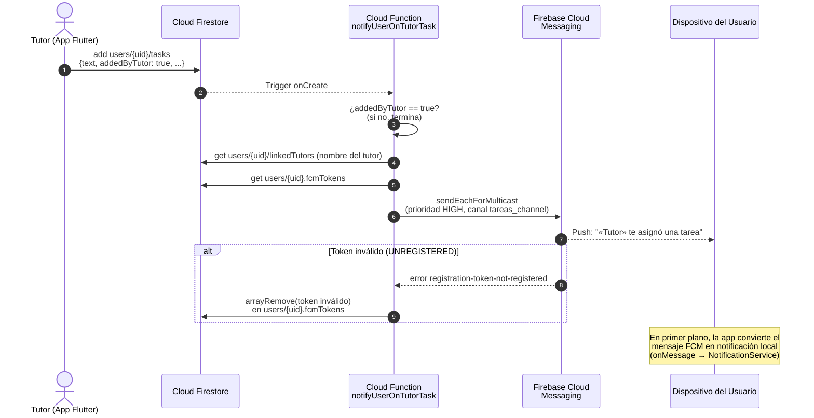
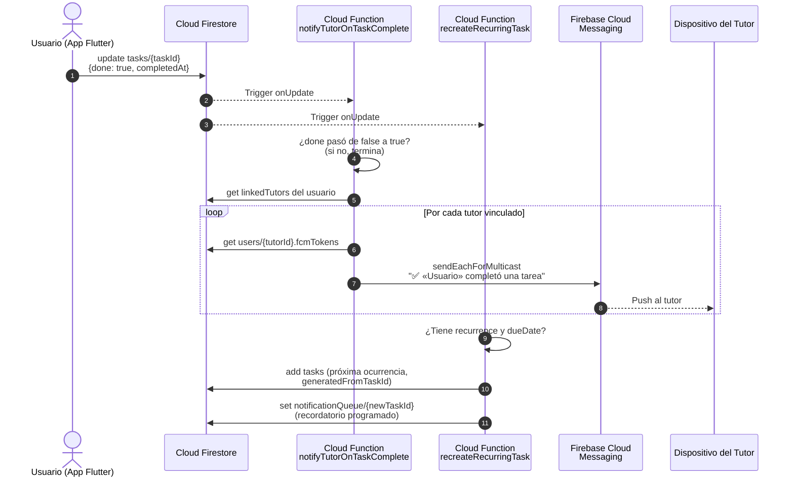

# D.7 Diagramas de Secuencia: Notificaciones Push Remotas (FCM)

> **Versión Mermaid** para renderizar en GitHub, GitLab, Notion o [Mermaid Live Editor](https://mermaid.live)
>
> Corresponde a las Figuras 8, 9 y 10 del Informe Técnico (Módulo 8: Notificaciones Push Remotas).

---

## D.7.1 Secuencia: El tutor asigna una tarea → push inmediata al usuario

La función `notifyUserOnTutorTask` se dispara con el evento `onCreate` de Firestore
sobre `users/{userId}/tasks/{taskId}` y solo actúa si el documento lleva la marca
`addedByTutor: true`. El envío usa `sendEachForMulticast` con prioridad alta y el
canal Android `tareas_channel`; los tokens rechazados por FCM se eliminan del
documento del usuario en la misma ejecución (auto-limpieza).



---

## D.7.2 Secuencia: El usuario completa una tarea → push al tutor

La función `notifyTutorOnTaskComplete` se dispara con `onUpdate` y filtra
exclusivamente la transición `done: false → true`. En paralelo,
`recreateRecurringTask` evalúa si la tarea tiene `recurrence` y genera la
siguiente ocurrencia con su recordatorio encolado.



---

## D.7.3 Flujo: Ciclo de vida del token FCM y bug del respaldo automático

Documenta la causa raíz de la incidencia "las push no llegan tras reinstalar el
APK" y su corrección definitiva (`android:allowBackup="false"`).

```mermaid
flowchart TD
    A[Instalación del APK] --> B{¿Auto Backup de Android<br/>restaura datos previos?}
    B -- "Sí (allowBackup=true,<br/>comportamiento por defecto)" --> C[El caché del SDK de FCM<br/>vuelve con el TOKEN VIEJO<br/>invalidado al desinstalar]
    C --> D[getToken() devuelve<br/>el token muerto]
    D --> E[La app lo registra en<br/>users/uid.fcmTokens]
    E --> F[FCM responde UNREGISTERED:<br/>ninguna push llega al dispositivo]
    F --> G[La Cloud Function limpia el token,<br/>pero la app lo re-registra<br/>en cada arranque: círculo vicioso]
    B -- "No (allowBackup=false,<br/>corrección aplicada)" --> H[Instalación limpia:<br/>FCM genera un token NUEVO y válido]
    H --> I[syncUserToken lo guarda con arrayUnion<br/>y se suscribe a onTokenRefresh]
    I --> J[Las push llegan con normalidad]

    style F fill:#fdd,stroke:#c00
    style G fill:#fdd,stroke:#c00
    style J fill:#dfd,stroke:#080
```

**Notas de implementación:**

- El token FCM identifica a la *instalación* de la app en un dispositivo, no a la
  cuenta. Por eso `syncUserToken` se ejecuta tras cada login (AuthGate) y usa
  `arrayUnion` para soportar múltiples dispositivos por usuario.
- La verificación de entrega end-to-end se realizó enviando un mensaje directo a
  la API HTTP v1 de FCM (`projects/{id}/messages:send`) con el token registrado,
  aislando la app del diagnóstico: la respuesta `404 NotRegistered` confirmó el
  token muerto restaurado por el respaldo.
- La latencia de entrega depende de las políticas de energía del fabricante
  (MIUI/Xiaomi retiene pushes de apps instaladas por APK): se documenta como
  limitación operativa, no como defecto del pipeline.
