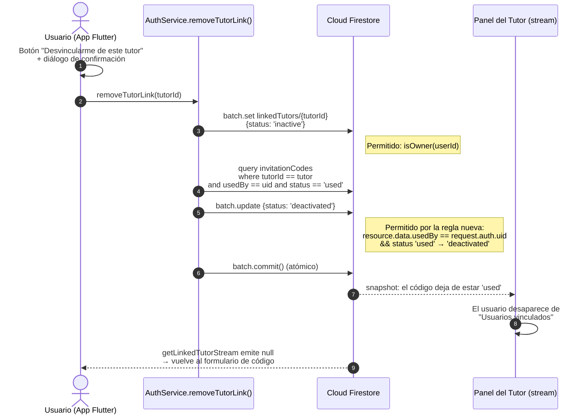
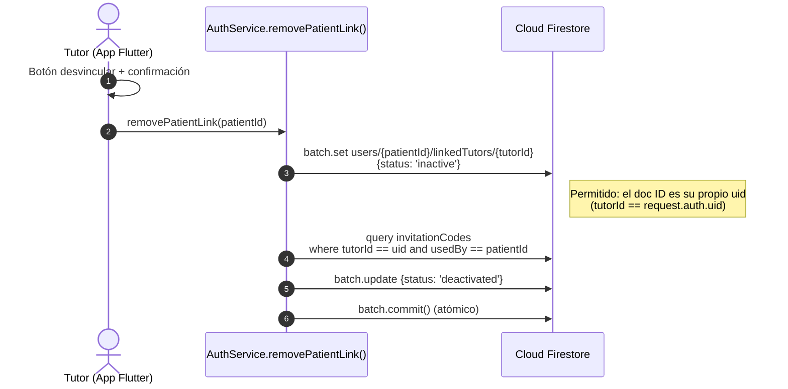

# D.8 Diagrama de Secuencia: Desvinculación Bidireccional Tutor ↔ Usuario

> **Versión Mermaid** para renderizar en GitHub, GitLab, Notion o [Mermaid Live Editor](https://mermaid.live)
>
> Corresponde a la Figura 11 del Informe Técnico (Módulo 5: Vinculación, versión corregida).

---

## D.8.1 Contexto de diseño

La versión inicial del sistema solo permitía que el **tutor** terminara la
vinculación (`removePatientLink`). El usuario quedaba imposibilitado de retirar
el acceso de su tutor, lo que constituye un problema de autonomía y de
escalabilidad (un usuario adulto debe poder revocar la supervisión sin depender
de la contraparte). La corrección introduce `removeTutorLink` (desvinculación
iniciada por el usuario) y una regla de seguridad adicional en Firestore que
autoriza al usuario que consumió un código a desactivarlo.

**Fuente de verdad del vínculo:** `users/{uid}/linkedTutors/{tutorId}.status`
(`active` / `inactive`). La lista "Usuarios vinculados" del panel del tutor se
deriva de `invitationCodes` con `status == 'used'`, por lo que ambas rutas de
desvinculación deben desactivar también el código consumido.

---

## D.8.2 Secuencia: desvinculación iniciada por el USUARIO (nueva)



---

## D.8.3 Secuencia: desvinculación iniciada por el TUTOR (existente)



---

## D.8.4 Extracto de la regla de seguridad agregada

```javascript
// /invitationCodes/{code} — regla de actualización (versión corregida)
allow update: if isAuthenticated() && (
  resource.data.tutorId == request.auth.uid            // el tutor dueño
  ||
  (resource.data.status == 'active' &&                 // aceptar el código
   request.resource.data.status == 'used' &&
   request.resource.data.usedBy == request.auth.uid)
  ||
  (resource.data.status == 'used' &&                   // NUEVA: el usuario que lo
   resource.data.usedBy == request.auth.uid &&         // consumió puede desactivarlo
   request.resource.data.status == 'deactivated')      // (desvinculación propia)
);
```
